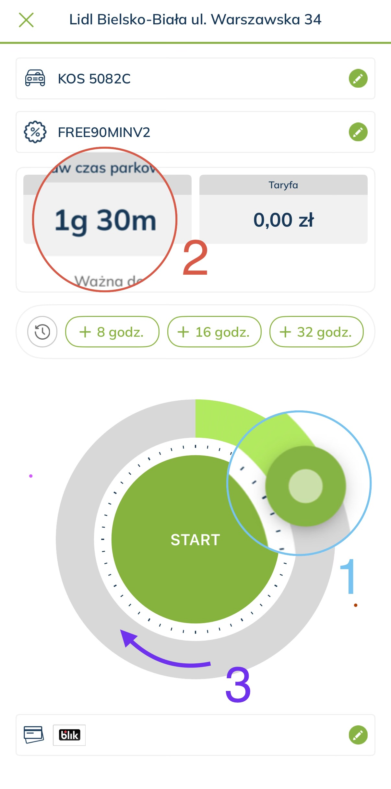

Mam 3 sugestie ktore moga troche usprawnic procesy uzytkownika w aplikacji, oraz dodac troch intuicyjnosci.
Sugestie 1,2 i 3 opisane po # ponizej ponimerowane jak opcje zaznaczone na zdjeciu

#1 Suwak ustawien czasu postoju- 
w tej chwili jest on nijaki tzn ustawiajac go nie widzimy jaki czas mamy w danej pozycji czas pokazuje sie dopiero po odpuszczeniu palca.

A ja mysle ze ciekawa opcja byloby gdyby czas pokazywal nam sie w czasie rzeczywistym przy poruszaniu suwakiem.

#2 Okienko z ustawionym czasem postoju-
Obecnie sluzy tylko jako podglad zczytujac zmienna.

Wygodna opcja byloby gdyby mozna bylo kliknac i ustawic wpisujac lub wybierajac z listy czas postoju.
pomoze to zdecydowanie ludziom mniej "technologicznym" gdzie przesuwanie precyzyjne suwakiem moze sprawiac problem i irytacje.

#3 Zmiana koloru piersciena w zaleznosci od przejscia z strefy darmowej na platna
obecnie nie zaleznie od pozycji suwaka na pierscieniu kolor mamy zielony

Intuicyjniejsza opcja byloby ustawic tak aby w darmowej strefie czasowej zostal np zielony ale jezeli ustawimy platna strefe czasowa zmieni kolor na np zolty lub czerwony (sugeruje zolty- mniej agresywny)
Zwiekszy to czytelnosc dla uzytkownika.

